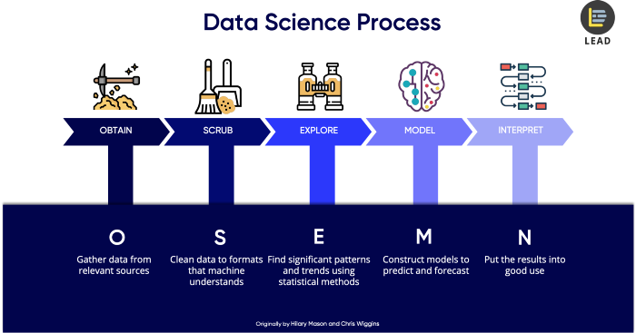

```{r setup, include=FALSE}
knitr::opts_chunk$set(echo = TRUE)
```

an introduction/overview/executive summary section that describes the dataset and summarizes the goal of the project and key steps that were performed
a methods/analysis section that explains the process and techniques used, including data cleaning, data exploration and visualization, insights gained, and your modeling approach
a results section that presents the modeling results and discusses the model performance
a conclusion section that gives a brief summary of the report, its limitations and future work

# Abstract
## Purpose of this report
This report is written as part of a submission requirement of Capstone course, the ninth course in HarvardX Data Science Professional Certificate Program.

## Objective of this report
This objective of this report is to apply the knowledge acquired throughout the Harvardx Data Science courses, 
analyze the given MovieLens dataset, and suggests the best model to predict the preference of a user on a movie, at a rate from 0.5 to 5.0.

## Project Goal
The goal of the project is to predict users movie rating (using MovieLens 10M Dataset) using models as such to obtain the lowest Rooted Mean Square Error (RMSE). The RMSE target is 0.86490 or lesser.


# Introduction
## Recommendation Systems
Recommendation systems, a newer and wider definition of 80's Decision Support Systems, brings the logic or reasoning of a decision from the hand of a human to machine. This improvement from Decision Support Systems not only increase the accuracy and speed of recommendation to the business, but with a wider scale, with increased capability, scalability and affordability. 

Today, Recommendation system is part of our life. It is now widely adopted in commercial solutions to the general public. It forms the main engine of the video recommendation by tiktok, youtube, netflix, etc., traffic route recommendation by waze, google map, etc., products recommendation at ecommerce site like Amazon, Lazada, Shoppee, etc.. There's no surprise even the typical brick & mortal shops already using recommendation systems for the placement of products, store layout, promotion and etc.

The main feature of Recommendation System is to predict either discrete or continuous probability of events based on given known historical data. It predicting rating or preference a typical user would decides by applying the best fit algorithms or models.

A recommendation systems is highly rely on given historical data that it's use to "train" the algorithm or model. It's learn from the historical data, and model the outcome based on data points, which subsequently used to derive or predict outcome of given new dataset. It result is typically in a predefined scale, e.g. from 0 to 1, of which is subsequently interpreted into rating or preferences of choice, e.g. rating from 1 to 5, or choice of Yes or No, etc.

## MovieLens (10M) Dataset
MovieLens is a dataset that contains users preferences of movies. The data is originated from eachmovie.org and subsequently becoming a research platform by GroupLens Research, a research lab in the University of Minnesota.

GroupLens published several MovieLens dataset. The full dataset (last updated 9/2018) contains 27,000,000 ratings and 1,100,000 tag applications applied to 58,000 movies by 280,000 users.

For the purpose of this report, the MovieLens 10M dataset is used. This dataset is released in Jan 2009, and  contains 10,000,000 ratings and 100,000 tag applications applied to 10,000 movies by 72,000 users. 


## Key steps
In order to achieve the objective and goal, a proper define steps are important ensuring the produced analysis and its results are correct. For this project, I am following the OSEMN Framework process:



OSEMN Framework process is a standardized process that is widely accepted and used among data science practitioners. This framework governs steps taken, ensuring probability of accurate analysis whilst allows steps to be backtrack-able and re-executable. OSEMN Framework process is consists of following 5 steps:

**Step1 Obtain Data**  

Obtain data means identifying and acquiring the needed and correct data. This step is very important as a flawed data will miss-led and impact the probability of getting accurate prediction. After the complete dataset is obtained or downloaded, the data should be parsed and prepared in a form that to be processes.

**Step2 Scrub Data**  

Scrub data means to clean or filter unwanted "noise" from dataset. Depends on the quality of dataset, sometime a massive data cleansing may be required. This step need to be taken out properly and data should be explored from all angles, as "garbage in, garbage out" philosophy, not clean data with irrelevant or incorrectly parse data may rendered analyzed result null.

**Step3 Explore Data**  

Explore data means examine data, or making sense of the dataset. This step involve careful inspecting data properties, e.g. data cardinality, relationship, factors, and data types like numerical, categorical, ordinal, nominal, etc..  

Descriptive statistics are always compute to extract features and to test significant variables and their correlation. These extracted info are normally present in visualisation (e.g. chart) for patterns and trends identification.

**Step4 Model Data**  

Model data is the step where models are select, applied, tuned and execute to get the required outcome. This is the key step that resulted whether we able to produce a correct and high probability prediction, or biased or wrong analysis.  

Here, dimension of dataset is scrutinize and reduced if necessary, select the relavent features and value that contributes to the prediction of results. Various models are select and train:
+ logistic regressions to perform classification to differentiate value,
+ linear regression to forecast value,
+ clustering by grouping data for better understanind of the logic,
+ etc.

In short, regression and predictions are use for forecasting future values, whilst classification to identify, and clustering to group values.

**Step5 Interpreting Data**  

Interpreting Data means interpreting models and data, and presenting outcome in a human readable format. This is the final but most crucial step of a data science project.  
There is no standard format on how outcome should be presented, it can be a simplified chart as printed on newspaper, or series of highly technical charts  for technical reader. A well-structured, clear and with actionable story report with relavent visual and data helps readers read and understands.

In short, regardless how good all other steps are performed, failure to present and communicate to the reader means the efforts are not appreciated.


# Methods & Analysis
## Methods
The method that is used in this report is **loss function**. Loss function is a function that estimate parameter of an event or value of one or more variables of the difference between estimated and true values for an instance of data."

Commonly in use loss functions include squared loss function, mean absolute error (MAE), mean squared error (MSE) and root mean squared error (RMSE).

### Squared Loss Function
Squared loss function is the most commonly us loss function. if $\hat y_i$ is the predictor and $y_i$ is the observed outcome, the squared loss function is:


  $$(\hat y_i-y_i)^2$$


### Mean Squared Error (MSE) 
Mean squared error is similar with squared loss function, averaging the squared error of the predictions. The formula give more weight to larger error. The mean squared error function is:

If N is the number of observations, the mean squared error formula is:

 $$MSE = {1\over N} \sum^{N}_{i=1}(\hat y_i-y_i)^2$$

### Root Mean Squared Error (RMSE)
Root mean squared error is similar to mean squared error and give more weight to larger error, minimizing the impact from smaller errors. RMSE is always use instead of MSE because RMSE preserve the original unit of measurement.

The root mean squared error formula is:
 $$RMSE =  \sqrt {{1\over N} \sum^{N}_{i=1}(\hat y_i-y_i)^2}$$

### Mean Absolute Error (MAE)
Mean absolute error is the average of absolute differences between the predicted value and the true value, producing a linear value, which all errors are equally weighted. Thus, when predicting ratings in a scale of 1 to 5, the MAE assumes that an error of 2 is twice as bad as an error of 1.

if$N$ is the number of observations, the MAE is given by this formula:

 $$MAE = {1\over N} \sum^{N}_{i=1}|\hat y_i-y_i|$$


## Processes & Tehniques

## Data Cleaning / Data Cleansing

## Data Exploration

## Data Visualization

## Data insights 

## Modeling approach

# Modeling Result

## Modeling & performance


# Conclusion
## Brief Summary
## Limitation
1. Hardware limitation
2. Algorithm limitation
3. Data limitation

## Future Works
1. continuous analysis
2. explore more algorithm


This is an R Markdown document. Markdown is a simple formatting syntax for authoring HTML, PDF, and MS Word documents. For more details on using R Markdown see <http://rmarkdown.rstudio.com>.

When you click the **Knit** button a document will be generated that includes both content as well as the output of any embedded R code chunks within the document. You can embed an R code chunk like this:

```{r cars}
summary(cars)
```

## Including Plots

You can also embed plots, for example:

```{r pressure, echo=FALSE}
plot(pressure)
```

Note that the `echo = FALSE` parameter was added to the code chunk to prevent printing of the R code that generated the plot.
