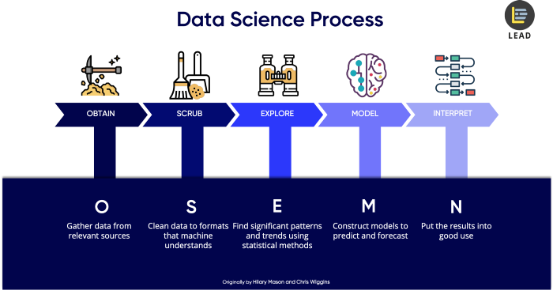

```{r setup, include=FALSE}
knitr::opts_chunk$set(echo = TRUE)

options(dplyr.summarise.inform = FALSE)
options(digits = 5)
```

an introduction/overview/executive summary section that describes the dataset and summarizes the goal of the project and key steps that were performed    

a methods/analysis section that explains the process and techniques used, including data cleaning, data exploration and visualization, insights gained, and your modeling approach    

a results section that presents the modeling results and discusses the model performance    

a conclusion section that gives a brief summary of the report, its limitations and future work

https://rpubs.com/vsi/movielens


# 1 Abstract
## Purpose of this report
This report is written as part of a submission requirement of Capstone course, the ninth course in HarvardX Data Science Professional Certificate Program.

## 1.1 Objective of this report
This objective of this report is to apply the knowledge acquired throughout the Harvardx Data Science courses, 
analyze the given MovieLens dataset, and suggests the best model to predict the preference of a user on a movie, at a rate from 0.5 to 5.0.

## 1.2 Project Goal
The goal of the project is to predict users movie rating (using MovieLens 10M Dataset) using models as such to obtain the lowest Rooted Mean Square Error (RMSE). The RMSE target is 0.86490 or lesser.


# 2 Introduction
## 2.1 Recommendation Systems
Recommendation systems, a newer and wider definition of 80's Decision Support Systems, brings the logic or reasoning of a decision from the hand of a human to machine. This improvement from Decision Support Systems not only increase the accuracy and speed of recommendation to the business, but with a wider scale, with increased capability, scalability and affordability. 

Today, Recommendation system is part of our life. It is now widely adopted in commercial solutions to the general public. It forms the main engine of the video recommendation by tiktok, youtube, netflix, etc., traffic route recommendation by waze, google map, etc., products recommendation at ecommerce site like Amazon, Lazada, Shoppee, etc.. There's no surprise even the typical brick & mortal shops already using recommendation systems for the placement of products, store layout, promotion and etc.

The main feature of Recommendation System is to predict either discrete or continuous probability of events based on given known historical data. It predicting rating or preference a typical user would decides by applying the best fit algorithms or models.

A recommendation systems is highly rely on given historical data that it's use to "train" the algorithm or model. It's learn from the historical data, and model the outcome based on data points, which subsequently used to derive or predict outcome of given new dataset. It result is typically in a predefined scale, e.g. from 0 to 1, of which is subsequently interpreted into rating or preferences of choice, e.g. rating from 1 to 5, or choice of Yes or No, etc.

## 2.2 MovieLens (10M) Dataset
MovieLens is a dataset that contains users preferences of movies. The data is originated from eachmovie.org and subsequently becoming a research platform by GroupLens Research, a research lab in the University of Minnesota.

GroupLens published several MovieLens dataset. The full dataset (last updated 9/2018) contains 27,000,000 ratings and 1,100,000 tag applications applied to 58,000 movies by 280,000 users.

For the purpose of this report, the MovieLens 10M dataset is used. This dataset is released in Jan 2009, and  contains 10,000,000 ratings and 100,000 tag applications applied to 10,000 movies by 72,000 users. 


## 2.3 Key steps
In order to achieve the objective and goal, a proper define steps are important ensuring the produced analysis and its results are correct. For this project, I am following the OSEMN Framework process:



OSEMN Framework process is a standardized process that is widely accepted and used among data science practitioners. This framework governs steps taken, ensuring probability of accurate analysis whilst allows steps to be backtrack-able and re-executable. OSEMN Framework process is consists of following 5 steps:

### 2.3.1 Step1 Obtain Data

Obtain data means identifying and acquiring the needed and correct data. This step is very important as a flawed data will miss-led and impact the probability of getting accurate prediction. After the complete dataset is obtained or downloaded, the data should be parsed and prepared in a form that to be processes.

### 2.3.2 Step2 Scrub Data

Scrub data means to clean or filter unwanted "noise" from dataset. Depends on the quality of dataset, sometime a massive data cleansing may be required. This step need to be taken out properly and data should be explored from all angles, as "garbage in, garbage out" philosophy, not clean data with irrelevant or incorrectly parse data may rendered analyzed result null.

### 2.3.3 Step3 Explore Data

Explore data means examine data, or making sense of the dataset. This step involve careful inspecting data properties, e.g. data cardinality, relationship, factors, and data types like numerical, categorical, ordinal, nominal, etc..  

Descriptive statistics are always compute to extract features and to test significant variables and their correlation. These extracted info are normally present in visualisation (e.g. chart) for patterns and trends identification.

### 2.3.4 Step4 Model Data

Model data is the step where models are select, applied, tuned and execute to get the required outcome. This is the key step that resulted whether we able to produce a correct and high probability prediction, or biased or wrong analysis.  

Here, dimension of dataset is scrutinize and reduced if necessary, select the relavent features and value that contributes to the prediction of results. Various models are select and train:
+ logistic regressions to perform classification to differentiate value,
+ linear regression to forecast value,
+ clustering by grouping data for better understanind of the logic,
+ etc.

In short, regression and predictions are use for forecasting future values, whilst classification to identify, and clustering to group values.

### 2.3.5 Step5 Interpreting Data

Interpreting Data means interpreting models and data, and presenting outcome in a human readable format. This is the final but most crucial step of a data science project.  

There is no standard format on how outcome should be presented, it can be a simplified chart as printed on newspaper, or series of highly technical charts  for technical reader. A well-structured, clear and with actionable story report with relavent visual and data helps readers read and understands.

In short, regardless how good all other steps are performed, failure to present and communicate to the reader means the efforts are not appreciated.


# 3 Methods & Analysis
## 3.1 Methods

The method that is used in this report is **loss function**. Loss function is a function that estimate parameter of an event or value of one or more variables of the difference between estimated and true values for an instance of data.

Commonly in use loss functions include squared loss function, mean absolute error (MAE), mean squared error (MSE) and root mean squared error (RMSE).

In this project, Root Mean Squared Error is selected for reporting of prediction outcome.


### 3.1.1 Squared Loss Function
Squared loss function is the most commonly us loss function. if $\hat y_i$ is the predictor and $y_i$ is the observed outcome, the squared loss function is:


  $$(\hat y_i-y_i)^2$$


### 3.1.2 Mean Absolute Error (MAE)
Mean absolute error is the average of absolute differences between the predicted value and the true value, producing a linear value, which all errors are equally weighted. Thus, when predicting ratings in a scale of 1 to 5, the MAE assumes that an error of 2 is twice as bad as an error of 1.

if$N$ is the number of observations, the MAE is given by this formula:

 $$MAE = {1\over N} \sum^{N}_{i=1}|\hat y_i-y_i|$$


### 3.1.3 Mean Squared Error (MSE) 
Mean squared error is similar with squared loss function, averaging the squared error of the predictions. The formula give more weight to larger error. The mean squared error function is:

If N is the number of observations, the mean squared error formula is:

 $$MSE = {1\over N} \sum^{N}_{i=1}(\hat y_i-y_i)^2$$

### 3.1.4 Root Mean Squared Error (RMSE)
Root mean squared error is similar to mean squared error and give more weight to larger error, minimizing the impact from smaller errors. RMSE is always use instead of MSE because RMSE preserve the original unit of measurement.

The root mean squared error formula is:
 $$RMSE =  \sqrt {{1\over N} \sum^{N}_{i=1}(\hat y_i-y_i)^2}$$


## 3.2 Processes & Tehniques
OSEMN Framework process is followed in this project to ensure standardize procedure and good data organization that increase the probability of getting accurate outcome. As discussed in previous, chapter, the OSEMN Framework process involves following 5 steps. In the following sections, I am executing the MovieLens modeling following the OSEMN Framework.

### 3.2.1 Step1 Obtain Data
The MovieLens 10M data set for this project is downloaded from grouplens.org. The file ml-10m.zip is downloaded using following codes:

```{r include=FALSE}
library(tidyverse)
library(caret)
library(data.table)
library(scales)
```

```{r download_data}
dl <- tempfile()
download.file("http://files.grouplens.org/datasets/movielens/ml-10m.zip", dl)
```

```{r include=FALSE}
library(R.utils)
library(formattable)
```


The downloaded ml-10m.zip contains following 2 files: 

1. movies.dat (`r comma(file.size("ml-10M100K/ratings.dat"), digits=0)` bytes)
2. ratings.dat (`r comma(file.size("ml-10M100K/movies.dat"), digits=0)` bytes)

File movies.dat contains `r comma(countLines("ml-10M100K/movies.dat")[1], digits=0)` rows of reviewed movies and its genes, whilst the ratings.dat contains `r comma(countLines("ml-10M100K/ratings.dat")[1], digits=0)` rows of movies rating. These 2 files are read and merge into the main dataset for the project analysis. Following codes are used to prepare the data for analysis:

<!--
# DO TAKE NOTE OF NROWS=100000 ---< THIS IS FOR USE FOR DEBUGING ONLY .... NEED TO REMOVE 
-->
```{r prepare_data}
# ratings <- fread(text = gsub("::", "\t", readLines(unzip(dl, "ml-10M100K/ratings.dat"))),
#                 col.names = c("userId", "movieId", "rating", "timestamp"), nrows=100000)
ratings <- fread(text = gsub("::", "\t", readLines(unzip(dl, "ml-10M100K/ratings.dat"))),
                 col.names = c("userId", "movieId", "rating", "timestamp"))

movies <- str_split_fixed(readLines(unzip(dl, "ml-10M100K/movies.dat")), "\\::", 3)
colnames(movies) <- c("movieId", "title", "genres")

movies <- as.data.frame(movies) %>% mutate(movieId = as.numeric(movieId),
                                           title = as.character(title),
                                           genres = as.character(genres))

movielens <- left_join(ratings, movies, by = "movieId")
```

The output movielens (`r class(movielens)[1]` class) parameter contains `r comma(nrow(movielens), digits=0)` rows of data which each row consists of `r names(movielens)` data. 


#### 3.2.1.1 Prepare edx (training) and validation dataset\

As setup in toe project guideline, the model exploration should only be performed on the training dataset, and the validation dataset should be only use for final model evaluation. As such, i incorporated following script to separate movielens dataset into edx (training) and validation dataset.

``` {r prepare_dataset}
set.seed(1, sample.kind="Rounding")
test_index <- createDataPartition(y = movielens$rating, times = 1, p = 0.1, list = FALSE)
edx <- movielens[-test_index,]
validation <- movielens[test_index,]
```


### 3.2.2 Step2 Scrub Data
Prior performing data analysis and modeling, it's important ensuring dataset is clean.

``` {r ensure_relationship}
temp <- validation
validation <- validation %>% 
  semi_join(edx, by = "movieId") %>%
  semi_join(edx, by = "userId")

removed <- anti_join(temp, validation)
edx <- rbind(edx, removed)
```

The most important data scrubbing is to ensure that the partitioned data, especially the edx (training) dataset contains all movies and users of the validation dataset. This step is crucial preventing missing relationship during modeling that resulted in null (N.A.) value that is not handled by RMSE function.

#### 3.2.2.1 Ensure no null (NA) data\

This step is important as null data will affect the overall analysis and may seriously jeopardize the outcome. The checking is perform by running follow syntax.

``` {r null_checking}
anyNA(validation)
anyNA(edx)
```

Based on above analysis, there is no null data thus, the dataset is good for further analysis.


### 3.2.3 Step3 Explore Data
``` {r include=FALSE}
library(lubridate)
```

There are total of `r comma(nrow(movielens), digits=0)` rows of record in the movieLens dataset. Of each  `r comma(nrow(edx), digits=0)` rows partition into edx (training) dataset and `r comma(nrow(validation), digits=0)` rows into the validation dataset.

Following are some sample records of the movielens:
``` {r include=FALSE}
movielens[1:5,]
```

*As the project instruction, we have to assume that we only knows about the edx dataset, and perform all activities, including data exploration, data analysis, modeling and prediction only on edx dataset, thus, the following activities are only performing on edx dataset.*

#### 3.2.3.1 Columns Definition\

This is always a overlook step in data preparation. Sometime, due to input or parsing mistake, or sometimes due to the origin of dataset, some data are parse incorrectly, e.g. alphabet in timestamp, space in between number in id column, etc.


##### 3.2.3.1.1 Movie ID (movieId)\

Movie ID are the unique id for each movie. There are total of `r comma(length(unique(edx$movieId)), digits=0)` movies in the dataset. Movie ID column (movieId) data type is numeric ranging from `r min(edx$movieId)` to `r max(edx$movieId)`.

Following are some sample movieId:
``` {r sample_movie}
unique(edx$movieId)[1:100]
```

```{r include=FALSE}
movieid_rating <- edx %>% group_by(movieId) %>% 
  summarise(count=n()) %>% as.data.frame()
  row.names(movieid_rating) <- movieid_rating$movieId
```

``` {r movieid_chart}
edx %>% group_by(movieId) %>% 
  summarise(count=n()) %>%
  ggplot(aes(movieId, log10(count))) + geom_point() + theme_minimal() 
```

Based on above chart, we notice movie id `r which.max(movieid_rating$count)` rated `r max(movieid_rating$count)` times whilst movie id `r which.min(movieid_rating$count)` only being rated `r min(movieid_rating$count)` times:\
+ total of `r comma(length(which(movieid_rating$count<=20)),digits=0)` movies rated less than 20 times\
+ total of `r comma(length(which(movieid_rating$count>=2000)),digits=0)`. \
+ sigma of count of movieId rating is `r sd(movieid_rating$count)` \
+ mean of count of movieId rating is `r mean(movieid_rating$count)`.  

This mean, we have to regularise count of movieId rating if movieId is use for modeling. 

By plotting movie id distribution, we notice the distribution is almost normal, which is support by above calcualted sigma and mean.

``` {r _movie_rating_chart}
edx %>% group_by(movieId) %>%
  summarise(n=n()) %>%
  ggplot(aes(n)) +
    geom_histogram(color = "white") +
    scale_x_log10() + 
    ggtitle("Distribution of Movies") +
    xlab("Number of Ratings") +
    ylab("Number of Movies") + 
    theme_minimal()
```

##### 3.2.3.1.2 User ID (userId)\

User ID are the unique id for each user. There are total of `r comma(length(unique(edx$userId)), digits=0)` users in the dataset. User ID column (userId) data type is numeric ranging from `r min(edx$userId)` to `r max(edx$userId)`.

Following are some sample userId:
``` {r sample_userId}
unique(edx$userId)[1:100]
```


```{r include=FALSE}
userid_rating <- edx %>% group_by(userId) %>% 
  summarise(count=n()) %>% as.data.frame()
  row.names(userid_rating) <- userid_rating$userId
```

we notice number of rating per user is not consistent, user id `r which.max(userid_rating$count)` rated `r max(userid_rating$count)` times whilst user id `r which.min(userid_rating$count)` only being rated `r min(userid_rating$count)` times: 
+ total of `r comma(length(which(userid_rating$count<=20)),digits=0)` users rated less than 20 times,
+ total of `r comma(length(which(userid_rating$count>=1000)),digits=0)` users rated more than 1000 times, 
+ sigma of count of userId rating is `r sd(userid_rating$count)` 
+ mean of count of userId rating is `r mean(userid_rating$count)`.  

Based on above analysis, we have to regularise count of userId rating if userId is use for modeling. 

By plotting rating against users, we notice the distribution is skewed toward right.
``` {r users_rating_chart}
edx %>% group_by(userId) %>%
  summarise(n=n()) %>%
  ggplot(aes(n)) +
    geom_histogram(color = "white") +
    scale_x_log10() + 
    ggtitle("Distribution of Users") +
    xlab("Number of Ratings") +
    ylab("Number of Users") + 
    scale_y_continuous(labels = comma) + 
    theme_minimal()
```

##### 3.2.3.1.3 Timestamp (timestamp)\

``` {r include=FALSE}
library(lubridate)
```
Timestamp are the Unix date time the rating is made by a user for a movie. In order to making sense of the timestamp data, I convert the data into year format using following codes:

``` {r yr_rating}
  edx <- edx %>% mutate(yr_rating=year(as_datetime(timestamp,origin="1970-01-01")))
```

Based on the data, the earliest rating is rated in `r min(edx$yr_rating)` and the latest rating is rated in `r max(edx$yr_rating)`. This means, rating of movies are done for a span of `r max(edx$yr_rating)-min(edx$yr_rating)` years, and based on following chart, i observed that:\
+ In year 2000, `r comma(nrow(edx[which(edx$yr_rating==2000)]),digits=0)` rating done,\
+ In year 2009, only `r comma(nrow(edx[which(edx$yr_rating==2009)]),digits=0)` rating done,\
+ sigma of year rating performed is `r sd(edx$yr_rating)`,\
+ mean of year rating perfoemd is `r mean(edx$yr_rating)`.

The figure above means the different between year are not so drastic, however, regularise of yr_rating may help smoothen data and reduce bias. 


```{r yr_rating_chart}
edx %>% ggplot(aes(x=yr_rating)) +
    geom_bar(color = "white") + 
    ggtitle("Rating Distribution Per Rating Year") +
    xlab("Year Rating") +
    ylab("Number of Ratings") +
    scale_y_continuous(labels = comma) + 
    theme_minimal()
```


##### 3.2.3.1.4 Movie Title (title)\

Column title contains the title of the movie suffix with release year. As movie title itself is not unique, suffixing release year is a common practice in the industry. Following some movie title that are reuse throughout the years:

``` {r include=FALSE}
title_unq <- unique(edx$title)
title_unq_wo_year <- substr(title_unq,1,str_length(title_unq)-7)
title_dup <- title_unq_wo_year[which(duplicated(title_unq_wo_year))]
title_dup[1:10]
```

for example movie with title "`r title_dup[2]`":
`r title_unq[str_starts(title_unq,"Psycho")][1:2] `

Movie with title "`r title_dup[2]`":
`r title_unq[str_starts(title_unq,title_dup[2])] `

The release year that suffix in this column is a data variant with interest. We have to separate this information into column named "yr_release"
``` {r yr_release}
edx <- edx %>% mutate(title=str_trim(title)) %>% 
  mutate(yr_release=as.numeric(substr(title,str_length(title)-4,
                                      str_length(title)-1)))
```

```{r include=FALSE}
yr_release <- edx %>% group_by(title, yr_release) %>% 
  summarise() %>% group_by(yr_release) %>% summarise(count=n()) %>% 
  as.data.frame()
  row.names(yr_release) <- yr_release$yr_release
```

After yr_release extracted from title column, we notice that movies listed are not consistence throughout the year, there are most movies release in year 2002, more movies release after 1993 and minimal movies release before 1929.
``` {r yr_release_chart}
edx %>% ggplot(aes(x=yr_release)) +
    geom_histogram(color = "white", binwidth = 1) + 
    ggtitle("Rating Distribution Per Release Year") +
    xlab("Year Release") +
    ylab("Number of Ratings") +
    scale_y_continuous(labels = comma) + 
    theme_minimal()
```

Breakdown of movie release before 1930:
`r yr_release %>% filter(yr_release<=1929) %>% select(count) %>% t() %>% knitr::kable(caption="Number of movie release before 1929", align="c")`

Breakdown of movie since 2002:
`r yr_release %>% filter(yr_release>=2002) %>% select(count) %>% t() %>% knitr::kable(caption="Number of movie release after 2002",align="c")`


##### 3.2.3.1.5 Rating (rating)\

Rating is the movie rating by each user for a movie. It is a numeric data with discrete value from 0.5 to 5.0 as shown in following table with the records count for each rating.
``` {r rating_table}
table(edx$rating)
```

Rating is the main variant that I am modeling on, predicting the rating value for each user-movie rating. Following is the rating distribution chart:

``` {r rating_chart}
edx %>% group_by(rating) %>% 
  summarise(count=n()) %>%
  ggplot(aes(x=rating, y=count)) + geom_line() + geom_point() + 
  scale_y_log10(breaks = trans_breaks("log10", function(x) 10^x), 
                labels = trans_format("log10", math_format(10^.x))) +
    ggtitle("Rating Distribution") + xlab("Rating") + ylab("Count") + 
  theme_minimal()
```

##### 3.2.3.1.6 Genes (genes)\

Genes are refer to the categorization of movies characterists. Each value of genes may contains concatenation of multiple gene seperate by pipe ("|"). This information is helpful to made better predictions, especially with correlating users. However, I don't use this value in my modeling.

The data set contains `r comma(length(unique(edx$genres)),digits=0)` different combinations of genres. Here is the list of the first 10.
``` {r genes_sample}
edx %>% group_by(genres) %>% 
  summarise(count=n()) %>%
  head(10)
```

#### 3.2.3.2 Data Relationship Exploration\

In addition of above columns levels data exploration, following data combination also explore to evaluate their relationship.


##### 3.2.3.2.1 Year Lapse Between Release Year and Review Year\

I hypotheses that user will not rate a movie using the same perspective, if the review is performed a period from the movie release date. This could be due to influence from the press and external information, or the release of better or worst movies of the similar topic or gerne, or remade. 

For the purpose, i introduced a new column yr_lapse, which is the year lapse between movie release year and rating year.
``` {r yr_lapse_prepare}
edx <- edx %>%
  mutate(yr_lapse=yr_rating-yr_release) 
```

Strangely, I notice `r length(which(edx$yr_lapse <0))` records which the rating is done before the movie release, i assume this is due to either the reviewed is done prior movie release, or error in data input:
``` {r yr_lapse_analysis}
edx[which(edx$yr_lapse <0),c(1,2,3,5,6,7,8,9)][1:10]
```

To mitigate the impact of this data to the overall prediction, I reset these yr_lapse value to zero (0) using following codes:
``` {r yr_lapse_parse0}
  edx <- edx %>% mutate(yr_lapse=ifelse(yr_lapse<=0,0,yr_lapse))
```

Following is the yr_lapse distribution:
``` {r yr_lapse_chart}
edx %>% group_by(yr_lapse) %>% 
  summarise(count=n()) %>%
  ggplot(aes(x=yr_lapse, y=count)) + geom_line() + geom_point() + 
  scale_y_log10(breaks = trans_breaks("log10", function(x) 10^x), 
                labels = trans_format("log10", math_format(10^.x))) +
    ggtitle("Year Lapse Distribution") + xlab("Year Lapse") + 
  ylab("Count") + theme_minimal()
```


##### 3.2.3.2.2 Users & Movies\

According to Principal Component Analysis, I notice that Users and movies are 2 most important variant of my modeling:

```{r user_movie_prcomp}
edx_minimal <- edx %>% select(userId,movieId,rating,yr_release,
                              yr_rating, yr_lapse)
edx_pca <- prcomp(edx_minimal)
edx_pca$rotation
```

```{r user_movie_prcomp_chart}
qplot(1:length(edx_pca$sdev), edx_pca$sdev, xlab = "PC", 
      ylab="SDev", colour = I("red"))
```

Via below (sampled) user-movie matrix, i notice the matrix is sparse, with the vast majority of empty cells.

``` {r user_movie_matrix_chart}
set.seed(1,sample.kind = "Rounding")
users <- sample(unique(edx$userId), 100)
edx %>% filter(userId %in% users) %>%
  select(userId, movieId, rating) %>%
#  mutate(rating = 1) %>%
  spread(movieId, rating) %>% 
  select(sample(ncol(.), 100)) %>% 
  as.matrix() %>% t(.) %>%
  image(1:100, 1:100,. , xlab="Movies", ylab="Users")
abline(h=0:100+0.5, v=0:100+0.5, col = "grey")
title("User x Movie Matrix")
```


### 3.2.4 Step4 Model Data\
#### 3.2.4.1 Data Preparation\

As discussed in Processes & Tehniques section above, 2 dataset edx and validation are prepared. As instructed by project requirement, the validation dataset can only be use for final model evaluation, thus the modeling analysis & training can only be done on edx dataset. 

For the purpose of modeling analysis and training, i partition the edx dataset into training dataset (edx_train) and test dataset (edx_test). The dataset is partition in such a way the training dataset (edx_train) contains 90% of edx data, and the test dataset (edx_test) contains 10% of edx data, without data overlapping. The dataset partitioning is perform using following codes:

``` {r edx_split}
set.seed(1,sample.kind = "Rounding")
test_index <- createDataPartition(y = edx$rating,
                                  times = 1, p = 0.1, list = FALSE)
edx_test <- edx[test_index]
edx_train <- edx[-test_index]

temp <- edx_test
edx_test <- temp %>% 
  semi_join(edx_train, by = "movieId") %>%
  semi_join(edx_train, by = "userId")

removed <- anti_join(temp, edx_test)
edx_train <- rbind(edx_train, removed)

rm(temp,removed)
```

Similar with the syntax use in partitioned movielens main dataset to edx (training) and validation dataset, dataset are scrub to ensure that the newly partitioned data, the edx_test dataset contains all movies and users of the edx_train dataset. This step is crucial preventing missing relationship during modeling that resulted in null (N.A.) value that is not handled by RMSE function


#### 3.2.4.2 Modeling Technique\

I am modeling movielens dataset first by calculating the mean from the entire dataset, and then applying Regularized Linear Regression.

The objective of modeling is to achieve RMSE below 0.8649
``` {r result_target}
result <- tibble(Method = "Project Target", RMSE = 0.8649)
result
```

##### 3.2.4.2.1 Using the mean\

I predict that the same rating will be given by all movies regardless of user, which demonstrated by following formula:
$$Y_{u,m} = \mu + \epsilon_{u,m}$$

where u is user and m is movie.  
The $\epsilon_{u,i}$ is the independent errors sampled from the same distribution centered at 0 and $\mu$ is the true rating for all movies.

Based on edx_traing dataset, the mean and RMSE of this estimation calculated using following syntax,and are respectively:
``` {r calculate_mu}
mu <- mean(edx_train$rating)
mu_rmse <- RMSE(edx_test$rating,mu)
result <- rbind(result, c(Method = "Mean", RMSE = mu_rmse))
result
```


##### 3.2.4.2.2 Using the Regularized Movie Effect\

As analyzed in Data Exploration section, I notice the count of ratings difference between the minimal and the most are quite a big gap, some movies are having less than 20 ratings. Regularised of Movie effect is necessary to reduce prediction error causing by this small sample data. The prediction formula with regularised movie effect is as follow:

$$Y_{u,m} = \mu + \hat b_m(\lambda) + \epsilon_{u,m}$$
where $\hat b_m(\lambda)$ is 
$$\hat b_m(\lambda) = {1\over {N_m+\lambda}} \sum^{N_m}_{m=1} (Y_{u,m}-\mu) $$
and $N_m$ is the number of ratings made for movie m.

Based on edx_train dataset, first I need to derive the tuning parameter $\lambda$. I define a sequence set of values for $\lambda$ and use following function to pick the value that minimises the RMSE.

``` {r calculate_movie_rmse}
movie_lambdas <- seq(0,5,0.25)

movie_sums <- edx_train %>% 
  group_by(movieId) %>% 
  summarise(movie_rating_sum=sum(rating-mu), movie_rating_count=n())

movie_rmses <- sapply(movie_lambdas, function(lambda){
  predicted_movie_rating <- edx_test %>%
    left_join(movie_sums, by='movieId') %>%
    mutate(movie_effect = movie_rating_sum/(movie_rating_count+lambda)) %>%
    mutate(predicted = movie_effect+mu) %>%
    pull(predicted)
  return(RMSE(predicted_movie_rating,edx_test$rating))
})

tibble(lambda = movie_lambdas, RMSE = movie_rmses) %>%
  ggplot(aes(x = lambda, y = RMSE)) +
    geom_point() +
    ggtitle("Movies Penalized Effect") +
    theme_minimal()
```

Based on above chart, the best $\lambda$ value for predicting regularised movie effect is `r movie_lambdas[which.min(movie_rmses)]` which give the RMSE value `r min(movie_rmses)`.

``` {r result_movie_rmse}
result <- rbind(result, c(Method = "Regularised Movie", 
                          RMSE = min(movie_rmses)))
result
```


##### 3.2.4.2.3 Using the Regularized User Movie Effect\

As analyzed in Data Exploration section, the count of rating of user is very much different with a big gap. Regularised User effect is also necessary to reduce prediction error causing. The new formula with regularised user effect, with $b_u$ is the average ranking for user u:

$$Y_{u,m} = \mu + \hat b_u(\lambda) + \hat b_m(\lambda) +\epsilon_{u,m}$$
where $\hat b_u(\lambda)$ is 
$$\hat b_u(\lambda) = {1\over {N_u+\lambda}} \sum^{N_u}_{u=1} (Y_{u,m}-\mu) $$
and $n_m$ is the number of ratings made for movie m.

Based on edx_train dataset, first we need to derive the tuning parameter $\lambda$. Using a define sequence values for $\lambda$, we get the $\lambda$ that minimises the RMSE.

``` {r calculate_user_movie_rmse}
user_movie_lambdas <- seq(0,10,0.25)

user_movie_rmses <- sapply(user_movie_lambdas, function(lambda){
  movie_sums <- edx_train %>%
    group_by(movieId) %>%
    summarise(movie_effect = sum(rating-mu) / (n()+lambda)) %>%
    select(movieId,movie_effect)
  
  user_sums <- edx_train %>%
    left_join(movie_sums, by="movieId") %>%
    group_by(userId) %>%
    summarise(user_effect = sum(rating-mu-movie_effect) / (n()+lambda))
  
  predicted_rating <- edx_test %>%
    left_join(user_sums, by='userId') %>%
    left_join(movie_sums, by="movieId") %>%
    mutate(predicted = mu + user_effect + movie_effect) %>%
    pull(predicted)
  return(RMSE(predicted_rating,edx_test$rating))
})

tibble(lambda = user_movie_lambdas, RMSE = user_movie_rmses) %>%
  ggplot(aes(x = lambda, y = RMSE)) +
    geom_point() +
    ggtitle("User Movies Penalized Effect") +
    theme_minimal()
```

Based on above chart, the best $\lambda$ value for predicting regularised user movie effect is `r user_movie_lambdas[which.min(user_movie_rmses)]` which give the RMSE value `r min(user_movie_rmses)`.

``` {r result_user_movie_rmse}
result <- rbind(result, c(Method = "Regularised User Movie", 
                          RMSE = min(user_movie_rmses)))
result
```

##### 3.2.4.2.4 Regularized using Other available variant\

Based on step 3 results as above, and also Principal Components Analysis, both movies & users are significant variants that affect rating prediction. In order to further minimise RMSE, increase prediction accuracy, I regularised following variants into the main formula:  
+ Release Year
+ Rating Year
+ Year Lapse between release and rating

With the above 3 additional variants, we repeat the step above, looking for the best $\lambda$ that minimise the RMSE.

``` {r calculate_all_in_lambda}
all_in_lambdas <- seq(0,10,0.25)

all_in_rmse <- sapply(all_in_lambdas, function(lambda){
  movie_sums <- edx_train %>%
    group_by(movieId) %>%
    summarise(movie_effect = sum(rating-mu) / (n()+lambda)) %>%
    select(movieId,movie_effect)
  
  user_sums <- edx_train %>%
    inner_join(movie_sums, by="movieId") %>%
    group_by(userId) %>%
    summarise(user_effect = sum(rating-mu-movie_effect) / (n()+lambda))
  
  yrrelease_sums <- edx_train %>%
    inner_join(user_sums, by="userId") %>%
    inner_join(movie_sums, by="movieId") %>%
    group_by(yr_release) %>%
    summarise(yrrelease_effect = sum(rating-mu-movie_effect-user_effect) / (n()+lambda))
  
  rellapse_sums <- edx_train %>%
    inner_join(user_sums, by="userId") %>%
    inner_join(movie_sums, by="movieId") %>%
    inner_join(yrrelease_sums, by="yr_release") %>%
    group_by(yr_lapse) %>%
    summarise(rellapse_effect = sum(rating-mu-movie_effect-user_effect-yrrelease_effect) / 
                (n()+lambda))
  
  yrrate_sums <- edx_train %>%
    inner_join(user_sums, by="userId") %>%
    inner_join(movie_sums, by="movieId") %>%
    inner_join(yrrelease_sums, by="yr_release") %>%
    inner_join(rellapse_sums, by="yr_lapse") %>%
    group_by(yr_rating) %>%
    summarise(yrrate_effect = sum(rating-mu-movie_effect-user_effect-yrrelease_effect-
                                    rellapse_effect) / (n()+lambda))
  
  predicted_rating <- edx_test %>%
    inner_join(user_sums, by='userId') %>%
    inner_join(movie_sums, by="movieId") %>%
    inner_join(yrrelease_sums, by="yr_release") %>%
    inner_join(rellapse_sums, by="yr_lapse") %>%
    inner_join(yrrate_sums, by="yr_rating") %>%
    mutate(predicted = mu + user_effect + movie_effect + yrrelease_effect + rellapse_effect + 
             yrrate_effect) %>%
    pull(predicted)
  return(RMSE(predicted_rating,edx_test$rating))
})
tibble(lambda = all_in_lambdas, RMSE = all_in_rmse) %>%
  ggplot(aes(x = lambda, y = RMSE)) +
    geom_point() +
    ggtitle("All Variant Penalized Effect") +
    theme_minimal()
```

According on above chart, the best $\lambda$ value for predicting regularised all variant effect is `r all_in_lambdas[which.min(all_in_rmse)]` which give the RMSE value `r min(all_in_rmse)`.

``` {r result_all_variants}
result <- rbind(result, c(Method = "Regularised All Variant", RMSE = min(all_in_rmse)))
result
```


### 3.2.4 Step5 Interpreting Data\

After taking into consideration of regularised user, movie, release year, rating year and rating lapse effects, the final RMSE `r min(user_movie_rmses)` is below the project target of 0.8649.

The final prediction script for the above modeling with final lambda value `r all_in_lambdas[which.min(all_in_rmse)]` is as below:

``` {r final_modeling_script}
final_lambda <- 5.0
movie_sums <- edx_train %>%
  group_by(movieId) %>%
  summarise(movie_effect = sum(rating-mu) / (n()+final_lambda)) %>%
  select(movieId,movie_effect)

user_sums <- edx_train %>%
  inner_join(movie_sums, by="movieId") %>%
  group_by(userId) %>%
  summarise(user_effect = sum(rating-mu-movie_effect) / (n()+final_lambda))

yrrelease_sums <- edx_train %>%
  inner_join(user_sums, by="userId") %>%
  inner_join(movie_sums, by="movieId") %>%
  group_by(yr_release) %>%
  summarise(yrrelease_effect = sum(rating-mu-movie_effect-user_effect) / (n()+final_lambda))

rellapse_sums <- edx_train %>%
  inner_join(user_sums, by="userId") %>%
  inner_join(movie_sums, by="movieId") %>%
  inner_join(yrrelease_sums, by="yr_release") %>%
  group_by(yr_lapse) %>%
  summarise(rellapse_effect = sum(rating-mu-movie_effect-user_effect-yrrelease_effect) / 
              (n()+final_lambda))

yrrate_sums <- edx_train %>%
  inner_join(user_sums, by="userId") %>%
  inner_join(movie_sums, by="movieId") %>%
  inner_join(yrrelease_sums, by="yr_release") %>%
  inner_join(rellapse_sums, by="yr_lapse") %>%
  group_by(yr_rating) %>%
  summarise(yrrate_effect = sum(rating-mu-movie_effect-user_effect-
                                  yrrelease_effect-rellapse_effect) / (n()+final_lambda))

predicted_rating <- edx_test %>%
  inner_join(user_sums, by='userId') %>%
  inner_join(movie_sums, by="movieId") %>%
  inner_join(yrrelease_sums, by="yr_release") %>%
  inner_join(rellapse_sums, by="yr_lapse") %>%
  inner_join(yrrate_sums, by="yr_rating") %>%
  mutate(predicted = mu + user_effect + movie_effect + yrrelease_effect + 
           rellapse_effect + yrrate_effect) %>%
  pull(predicted)

```


# 4 Modeling Result\

``` {r result_all_variants2}
result
```

As we can see from the result table, regularization and matrix factorization achieved the target RMSE. IN this section, we will use the validation dataset to validate the prediction script. The target is to achieve reqired RMSE less than 0.865.

## 4.1 Prepare Dataset\

Before I validate prepare modeling script, validation dateset need to be modify to ensure it's consists the required columns, data types and data cardinality. 4 data mutation activities to be executed:\

1. Prepare yr_release column for Movie Release yaer.\
2. Prepare yr_rating column for Rating year.\
3. Prepare yr_lapse column for the year lapse between Rating year and Release year.\

```{r prepare_validation}
validation <- validation %>% 
  mutate(title=str_trim(title)) %>% 
  mutate(yr_release=as.numeric(substr(title,str_length(title)-4,str_length(title)-1)))

validation <- validation %>% 
  mutate(yr_rating=year(as_datetime(timestamp,origin="1970-01-01")))

validation <- validation %>% 
  mutate(yr_lapse=yr_rating-yr_release) %>%
  mutate(yr_lapse=ifelse(yr_lapse<=0,0,yr_lapse))
```


## 4.2 Execute Model\

After dataset is prepared, I run the following modeling script that developed using training data set (edx_training and edx_test). The lambda value to use is 5.0, as simulated in previous section.

```{r run_validation}
final_lambda <- 5.0
mu <- mean(edx_train$rating)
movie_sums <- edx_train %>%
  group_by(movieId) %>%
  summarise(movie_effect = sum(rating-mu) / (n()+final_lambda)) %>%
  select(movieId,movie_effect)

user_sums <- edx_train %>%
  inner_join(movie_sums, by="movieId") %>%
  group_by(userId) %>%
  summarise(user_effect = sum(rating-mu-movie_effect) / (n()+final_lambda))

yrrelease_sums <- edx_train %>%
  inner_join(user_sums, by="userId") %>%
  inner_join(movie_sums, by="movieId") %>%
  group_by(yr_release) %>%
  summarise(yrrelease_effect = sum(rating-mu-movie_effect-user_effect) / (n()+final_lambda))

rellapse_sums <- edx_train %>%
  inner_join(user_sums, by="userId") %>%
  inner_join(movie_sums, by="movieId") %>%
  inner_join(yrrelease_sums, by="yr_release") %>%
  group_by(yr_lapse) %>%
  summarise(rellapse_effect = sum(rating-mu-movie_effect-user_effect-yrrelease_effect) / (n()+final_lambda))

yrrate_sums <- edx_train %>%
  inner_join(user_sums, by="userId") %>%
  inner_join(movie_sums, by="movieId") %>%
  inner_join(yrrelease_sums, by="yr_release") %>%
  inner_join(rellapse_sums, by="yr_lapse") %>%
  group_by(yr_rating) %>%
  summarise(yrrate_effect = sum(rating-mu-movie_effect-user_effect-yrrelease_effect-rellapse_effect) / (n()+final_lambda))

predicted_rating <- validation %>%
  inner_join(user_sums, by='userId') %>%
  inner_join(movie_sums, by="movieId") %>%
  inner_join(yrrelease_sums, by="yr_release") %>%
  inner_join(rellapse_sums, by="yr_lapse") %>%
  inner_join(yrrate_sums, by="yr_rating") %>%
  mutate(predicted = mu + user_effect + movie_effect + yrrelease_effect + rellapse_effect + yrrate_effect) %>%
  pull(predicted)

validation_rmse <- RMSE(predicted_rating,validation$rating)

```


## 4.3 Validation Result\
The script takes awhile to execute. With lambda value 5.0, the validation dataset RMSE is as `r validation_rmse`, which is less than the project target.

``` {r result_all_variants}
result <- rbind(result, c(Method = "Validation", RMSE = validation_rmse))
result
```


# 5 Conclusion
## 5.1 Brief Summary
The objective of this report is to apply the knowledge acquired throughout the Harvardx Data Science courses, 
analyze the given 10 million MovieLens dataset (downloaded from GroupLens Research) using Recommendation System approach, and suggests the best model to predict the preference of a user on a movie, at a rate from 0.5 to 5.0. To ensure the probability of accurate analysis, I selected and followed the OSEMN Framework standardized process. The process consists of 5 steps, (1) Obtain Data, (2) Scrub Data, (3) Explore Data, (4) Model Data and (5) Intepreting Data.

Linear Modeling with data Regularization technique is used for the analysis and prediction of data, with final resulted reported in Root Mean Squared Error (RMSE). The MovieLens columns userid, movieid, release year and rating year are regularised and used in my analysis in predicting rating. 

After extensive modeling, the validation result using the regularised regressive model is `r validation_rmse`. 

## 5.2 Limitation
There are few limitation encounters in research, analyze, training and choosing models for the project modeling:

### 5.2.1 Hardware limitation
The training and modeling are perform on a laptop that has limited memory and processing powers. I have attempted to evaluate RandomForest, KNN, and all others models, but all of them failed due to hardware limitation. 

This limitation can be overcome with a better hardware.

### 5.2.2 Algorithm limitation
According to MovieLens website, the are fews modeling that manage to achieve RMSE less than 0.7. Most of these modeling are performed on specialize program outside of R package. Apart of these algorithm, there's also other R package that I will explore if time and hardware resources permitted, e.g. Matrix Factorization using recosystem package.

This limitation can be overcome with more details exploration and research.

### 5.2.3 Exploration limitation
The modeling is performs on most of the available data, except gernes. I hypotheses user-gernes has some corration that affect how a user perceived and rates a movie. The modeling of gernes is not performed due to limitations above.

In addition, I encountered some strange data e.g. year review is before year release. Understanding of how this data exist will further helps in tuning the modeling.

## 5.3 Future Works
More research, analysis, and training of models are needed to get the best result in predicting user-movie rating from MovieLens dataset. The acquired knowledge can be extended and used in realtime model, e.g. in development of RobotChat, eCommerce products recommendation, etc.

